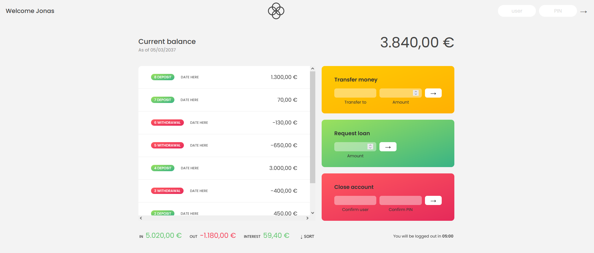

# Bank Functional Frontend

This is a version of a minimalist banking app. You will be able to use one of the 4 accounts already created to interact with the app.

## Table of contents

- [Overview](#overview)
  - [The challenge](#the-challenge)
  - [Screenshot](#screenshot)
  - [Links](#links)
- [My process](#my-process)
  - [Built with](#built-with)
  - [What I learned](#what-i-learned)
- [Author](#author)

## Overview

### The challenge

Creating a site that replicates the basic banking funcionalities: Receiving money, sending money, asking for a loan and deleting the account.

### Screenshot

### Links

- [Live Site URL](https://bankappbasic-with-js.netlify.app)

To use, there are 4 users created. You can only access or delete one of those 4 users and send or receive money from only those 4 users as well.

Use the credentials below to access:

| Username | Passsword |
| -------- | --------- |
| js       | 1111      |
| jd       | 2222      |
| stw      | 3333      |
| ss       | 4444      |

## My process

### Built with

- HTML5
- CSS
- Javascript

### What I learned

Handling the DOM with vanilla Javascript and updating certain parts of the DOM without refreshing the entire page.

## Author

- Frontend Mentor - [@dnewbie25](https://www.frontendmentor.io/profile/dnewbie25)
- DevChallenges - [dnewbie25](https://devchallenges.io/portfolio/dnewbie25)
